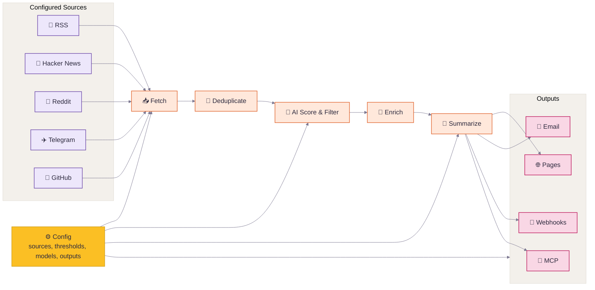

<div align="center">

# 🌅 Horizon

**Enjoy the News itself. Leave others to Horizon**

[](LICENSE)
[](https://github.com/astral-sh/uv)
[](https://thysrael.github.io/Horizon/)
[](https://github.com/Thysrael/Horizon/commits/main)
[](http://makeapullrequest.com)

<a href="https://hellogithub.com/repository/Thysrael/Horizon" target="_blank"></a>
<br>


📡 Your own AI-powered news radar. Generates daily briefings in English & Chinese. | 构建你专属的 AI 新闻雷达

[📖 Live Demo](https://thysrael.github.io/Horizon/) · [📋 Configuration Guide](https://github.com/short-seven/AI-News/blob/main/README_CN.md) · [简体中文](README_zh.md)

</div>

## Screenshots

<table># 🤖 AI News Radar — 每日 AI 新闻聚合站

[](https://short-seven.github.io/AI-News/)
[](https://short-seven.github.io/AI-News/)

> 📡 从噪声中提取信号，让你永远站在 AI 浪潮的前沿。

**🌐 在线阅读**: [https://short-seven.github.io/AI-News/](https://short-seven.github.io/AI-News/)

---

## 📖 项目简介

AI News Radar 是一个 **AI 驱动的每日新闻聚合系统**，每天自动从全球多个信息源搜集 AI/ML/LLM 相关新闻，经过去重、评分、筛选后，生成中英文双语摘要并发布到 GitHub Pages 站点。

### ✨ 核心特性

- 📡 **多源聚合** — Hacker News、Reddit、GitHub、RSS、Telegram、全球科技媒体
- 🤖 **AI 评分** — 每条新闻按影响力、新颖性、技术深度、社区热度、实用性 0-10 评分
- 🌐 **中英双语** — 同时生成中文和英文版本，一键切换
- 🌙 **双主题** — 暗色赛博朋克风 ↔ 浅色 Horizon Dawn，一键切换
- 📰 **RSS 订阅** — 支持 RSS/Atom 订阅（中文/英文分开）
- 🚀 **自动发布** — push 到 GitHub 后自动部署到 GitHub Pages

---

## 🏗️ 技术架构

```
信息源                    处理流程                      输出
┌─────────────┐    ┌──────────────────┐    ┌──────────────────┐
│ Hacker News │    │                  │    │                  │
│ Reddit      │───▶│  搜集 → 去重     │    │  GitHub Pages    │
│ GitHub      │    │  → AI 评分       │───▶│  (Jekyll 站点)   │
│ RSS Feeds   │    │  → 充实 → 生成   │    │                  │
│ Google News │    │                  │    │  RSS Feeds       │
│ Telegram    │    └──────────────────┘    └──────────────────┘
└─────────────┘
```

### 技术栈

| 组件 | 技术 |
|------|------|
| 站点生成 | **Jekyll** (GitHub Pages 内置) |
| 主题基础 | `jekyll-theme-cayman` |
| 自定义样式 | `horizon.css` — CSS Variables + 双主题 |
| 交互逻辑 | `horizon.js` — 语言切换 / 主题切换 / 评分徽章 |
| 字体 | Inter (Google Fonts) + 中文系统字体 |
| 部署 | GitHub Pages — push 自动构建 |

---

## 📁 项目结构

```
AI-News/
├── data/
│   └── config.json              # 信息源配置（源、阈值、模型、输出）
├── docs/                        # Jekyll 站点根目录
│   ├── _config.yml              # Jekyll 配置
│   ├── _includes/
│   │   └── head-custom.html     # 自定义 <head>（字体/样式/脚本）
│   ├── _posts/                  # 每日新闻文件（Jekyll 文章）
│   │   ├── 2026-04-30-zh.md     # 中文版
│   │   └── 2026-04-30-en.md     # 英文版
│   ├── assets/
│   │   ├── css/
│   │   │   └── horizon.css      # 全部样式（暗色 + 浅色双主题）
│   │   └── js/
│   │       └── horizon.js       # 交互逻辑
│   ├── index.md                 # 首页
│   ├── feed-zh.xml              # 中文 RSS
│   ├── feed-en.xml              # 英文 RSS
│   ├── configuration.md         # 配置文档
│   ├── scoring.md               # 评分系统文档
│   └── scrapers.md              # 信息源采集器文档
├── SKILL.md                     # OpenClaw Skill 定义（工作流 SOP）
├── README_CN.md                 # 本文件（中文说明）
└── README.md                    # 英文说明
```

---

## 📡 信息源配置

配置文件：`data/config.json`

### 当前启用的信息源

| 信息源 | 类型 | 配置 |
|--------|------|------|
| **Hacker News** | 热门故事 | Top 30，最低分 150 |
| **Reddit** | 子版块 | r/MachineLearning + r/LocalLLaMA，hot 排序，最低分 60 |
| **Simon Willison** | RSS | `simonwillison.net/atom/everything/` |
| **GitHub Trending** | RSS | 每日全语言热门 |
| **LWN.net** | RSS | Linux 内核新闻 |
| **GitHub Releases** | API | vllm, sglang, triton 发版监控 |
| **GitHub Users** | API | karpathy 动态监控 |
| **Telegram** | 频道 | zaihuapd |

### 筛选规则

```json
{
  "filtering": {
    "ai_score_threshold": 7.0,    // 低于 7 分不收录
    "time_window_hours": 24        // 只看过去 24 小时
  }
}
```

---

## 📰 新闻文件格式

每篇新闻为一个 Jekyll Post Markdown 文件：

### 命名规则
```
docs/_posts/YYYY-MM-DD-zh.md    # 中文
docs/_posts/YYYY-MM-DD-en.md    # 英文
```

### Front Matter
```yaml
---
layout: default
title: "每日 AI 速递"
date: 2026-04-30
lang: zh
---
```

### 正文结构

1. **标题** — `# 📡 每日 AI 速递 — YYYY年M月DD日`
2. **副标题** — 引用块，说明数据来源
3. **分类新闻** — 按 🔥头条 / 🛠️工具 / 🤖研究 / 🌐行业 分组
4. **每条新闻包含**：
   - 编号和标题（`### N. 标题`）
   - 评分（`**评分：N/10**`）
   - 来源链接
   - 摘要（50-300 字）
   - 高分新闻附关键洞察
5. **今日概览表格** — 分类汇总

### 评分标准（0-10）

| 维度 | 权重 | 说明 |
|------|------|------|
| 影响力 | 30% | 对 AI 行业的影响范围 |
| 新颖性 | 25% | 是否为新发现/发布 |
| 技术深度 | 20% | 技术内容的实质性 |
| 社区热度 | 15% | HN/Reddit 分数和讨论量 |
| 实用性 | 10% | 对开发者的直接价值 |

### 分类规则

| 分类 | 收录标准 |
|------|----------|
| 🔥 今日头条 | 评分 ≥ 9，或 HN ≥ 500 分，或重大事件 |
| 🛠️ 开发工具 & 开源 | 新工具、开源项目、SDK/框架 |
| 🤖 AI 研究 & 安全 | 论文、安全、对齐研究 |
| 🌐 科技 & 行业动态 | 公司、融资、政策、趋势 |

---

## 🎨 站点主题

### 暗色模式（默认）— 赛博朋克
- 深空黑底 `#0a0a0f`
- 霓虹渐变：青 `#00f0ff` · 紫 `#a855f7` · 粉 `#ec4899`
- 动态网格背景 + 浮动光晕动画
- 毛玻璃卡片效果

### 浅色模式 — Horizon Dawn
- 暖白底 `#faf8f5`
- 日出渐变：靛蓝 `#312e81` · 玫红 `#be185d` · 橙 `#f97316`
- 柔和阴影和温暖色调

**切换方式**：点击右上角 ☀️ / 🌙 按钮，选择自动记忆到 localStorage。

---

## 🔄 更新流程

### 自动模式（定时任务）

通过 OpenClaw Heartbeat 机制：
1. 每天北京时间 09:00 自动触发
2. 搜集前一天的 AI 新闻
3. 生成中英文 Markdown
4. commit & push 到 `main` 分支
5. GitHub Pages 自动部署
6. 飞书通知完成

### 手动模式

对 AI 助手说：
> "帮我搜集今天的 AI 新闻并更新到仓库"

助手会按照 `SKILL.md` 中的工作流执行。

### GitHub Actions 模式

也可以通过 `.github/workflows/daily-summary.yml` 手动触发 Horizon 的完整 pipeline（需要配置 API Keys 到 GitHub Secrets）。

---

## 🛠️ 本地开发

### 预览站点
```bash
# 安装 Jekyll（如果还没装）
gem install bundler jekyll

# 进入 docs 目录
cd docs

# 启动本地预览
bundle exec jekyll serve
# 访问 http://localhost:4000/AI-News/
```

### 手动添加新闻
```bash
# 创建新的新闻文件
touch docs/_posts/2026-05-01-zh.md
touch docs/_posts/2026-05-01-en.md

# 编辑内容（参考已有文件的格式）

# 提交推送
git add docs/_posts/
git commit -m "AI News(2026.5.1)"
git push origin main
```

---

## 📜 License

MIT License

---

## 🙏 致谢

- [Horizon](https://github.com/Thysrael/Horizon) — 项目灵感来源
- [Jekyll Theme Cayman](https://pages-themes.github.io/cayman/) — 基础主题
- [Hacker News](https://news.ycombinator.com/) / [Reddit](https://reddit.com/) / [Simon Willison](https://simonwillison.net/) — 信息源

<tr>
<td width="50%">
<p align="center"><strong>Ranked Daily Briefing</strong></p>

</td>
<td width="50%">
<p align="center"><strong>Context, Summary & Discussion</strong></p>

</td>
</tr>
</table>

<details>
<summary><strong>More Screenshots</strong></summary>
<br>
<table>
<tr>
<td width="33.33%">
<p align="center"><strong>Terminal Output</strong></p>

</td>
<td width="33.33%">
<p align="center"><strong>Feishu Notification</strong></p>

</td>
<td width="33.33%">
<p align="center"><strong>Email Delivery</strong></p>

</td>
</tr>
</table>
</details>

## Why Horizon?

Good news is scattered; bad news is endless. Horizon gives you a personal first pass over Hacker News, Reddit, Telegram, RSS, and GitHub: it fetches, deduplicates, scores, filters, and enriches stories with background context and community discussion.

But Horizon is not just another summarizer. AI is great at reducing noise, but news still needs human taste: the sources you trust, the comments that change how you read a story, and the hidden gems only people can share. Horizon keeps that human layer in the loop with customizable sources, thresholds, models, languages, delivery channels, comment summaries, and a community source hub.

## Features

- **📡 Watch Your Own Sources** — Track Hacker News, RSS, Reddit, Telegram, and GitHub releases or user activity in one pipeline
- **🤖 Turn Noise Into a Reading List** — Score each item from 0-10 with Claude, GPT, Gemini, DeepSeek, Doubao, MiniMax, or any OpenAI-compatible API
- **🔗 Merge Repeated Stories** — Deduplicate the same story across platforms before it reaches your briefing
- **🔍 Understand the Background** — Add web-researched context for unfamiliar concepts, companies, projects, and technical terms
- **💬 Read the Conversation** — Collect and summarize community comments from Hacker News, Reddit, and other supported sources
- **🌐 Publish in Two Languages** — Generate English and Chinese daily briefings from the same source set
- **📝 Ship a Daily Site** — Publish generated Markdown as a GitHub Pages daily briefing site
- **📧 Deliver by Email** — Run a self-hosted SMTP/IMAP newsletter with automatic subscribe and unsubscribe handling
- **🔔 Push to Chat or Automations** — Send templated results to Feishu/Lark, DingTalk, Slack, Discord, or custom webhook endpoints
- **🧙 Start From Your Interests** — Use the setup wizard to generate a personalized source configuration
- **⚙️ Tune the Radar** — Customize sources, thresholds, models, languages, and delivery channels from one JSON config

## How It Works



1. **Define** — Configure sources, thresholds, models, languages, and delivery from one JSON config.
2. **Fetch** — Pull latest content from all configured sources concurrently.
3. **Deduplicate** — Merge items pointing to the same story or URL across platforms.
4. **Score & Filter** — Use AI to rank items and keep only those above your threshold.
5. **Enrich** — Search the web for background context and collect community discussion for important items.
6. **Summarize** — Generate a structured Markdown briefing with summaries, tags, and references.
7. **Deliver** — Publish the result to GitHub Pages, email, webhooks such as Feishu, MCP, or local files.

## Quick Start

### 1. Install

**Option A: Local Installation**

```bash
git clone https://github.com/Thysrael/Horizon.git
cd horizon

# Install with uv (recommended)
uv sync

# Or with pip
pip install -e .
```

**Option B: Docker**

```bash
git clone https://github.com/Thysrael/Horizon.git
cd horizon

# Configure environment
cp .env.example .env
cp data/config.example.json data/config.json
# Edit .env and data/config.json with your API keys and preferences

# Run with Docker Compose
docker-compose run --rm horizon

# Or run with custom time window
docker-compose run --rm horizon --hours 48
```

### 2. Configure

**Option A: Interactive wizard (recommended)**

```bash
uv run horizon-wizard
```

The wizard asks about your interests (e.g. "LLM inference", "嵌入式", "web security") and auto-generates `data/config.json`.

**Option B: Manual configuration**

```bash
cp .env.example .env          # Add your API keys
cp data/config.example.json data/config.json  # Customize your sources
```

Minimal manual configuration:

```jsonc
{
  "ai": {
    "provider": "openai",
    "model": "gpt-4",
    "api_key_env": "OPENAI_API_KEY"
  },
  "sources": {
    "rss": [
      { "name": "Simon Willison", "url": "https://simonwillison.net/atom/everything/" }
    ]
  },
  "filtering": {
    "ai_score_threshold": 6.0
  }
}
```

For the full reference, see the [Configuration Guide](docs/configuration.md).

### 3. Run

#### Local Installation

```bash
uv run horizon           # Run with default 24h window
uv run horizon --hours 48  # Fetch from last 48 hours
```

#### With Docker

```bash
docker-compose run --rm horizon           # Run with default 24h window
docker-compose run --rm horizon --hours 48  # Fetch from last 48 hours
```

The generated report will be saved to `data/summaries/`.

### 4. Automate (Optional)

Horizon works great as a **GitHub Actions** cron job. See [`.github/workflows/daily-summary.yml`](.github/workflows/daily-summary.yml) for a ready-to-use workflow that generates and deploys your daily briefing to GitHub Pages automatically.

## Supported Sources

| Source | What it fetches | Comments |
|--------|----------------|----------|
| **Hacker News** | Top stories by score | Yes (top N comments) |
| **RSS / Atom** | Any RSS or Atom feed | — |
| **Reddit** | Subreddits + user posts | Yes (top N comments) |
| **Telegram** | Public channel messages | — |
| **GitHub** | User events & repo releases | — |

## Where Your Briefing Goes

Horizon can publish or deliver the generated briefing in several ways:

| Channel | What it does |
|---------|--------------|
| **GitHub Pages Daily Site** | Copies generated Markdown into `docs/` so GitHub Pages can publish a daily-updated briefing site |
| **Email Subscription** | Sends the daily briefing to subscribers and handles subscribe/unsubscribe requests through SMTP/IMAP |
| **Webhook Notification** | Pushes success or failure results to Feishu/Lark, DingTalk, Slack, Discord, or any custom webhook endpoint |
| **MCP Server** | Exposes Horizon pipeline steps as tools so AI assistants can fetch, score, filter, enrich, summarize, and run the full workflow |

For setup details, see the [Configuration Guide](docs/configuration.md). For MCP tool references and client setup, see [`src/mcp/README.md`](src/mcp/README.md) and [`src/mcp/integration.md`](src/mcp/integration.md).

## Documentation

| Guide | Description |
|-------|-------------|
| [Configuration](docs/configuration.md) | AI providers, sources, filtering, email, webhook, GitHub Pages, and MCP setup |
| [Scoring](docs/scoring.md) | How Horizon evaluates and ranks news items |
| [Scrapers](docs/scrapers.md) | Source scraper details and extension notes |
| [MCP Tools](src/mcp/README.md) | Tool reference for MCP-compatible clients |

## Project Status

Horizon already supports the full daily briefing loop: multi-source collection, AI scoring, deduplication, enrichment, comment summaries, bilingual generation, GitHub Pages publishing, email delivery, webhook delivery, Docker deployment, MCP integration, and the setup wizard.

Planned improvements:

- More source types, such as Twitter/X and Discord
- Custom scoring prompts per source
- Publish releases on GitHub
- Publish the package to PyPI for `pip install`

## Contributing

Contributions are welcome! Feel free to open issues or submit pull requests.

### Share Sources

Want to share valuable source discoveries with the Horizon community? Please submit them through **[horizon1123.top](https://horizon1123.top)**.

Great candidates: niche RSS discoveries, active subreddit trends, notable GitHub updates, or Telegram channel highlights in your area of expertise.

## Acknowledgements

- Special thanks to [LINUX.DO](https://linux.do/) for providing a promotion platform.
- Special thanks to [HelloGitHub](https://hellogithub.com/) for valuable guidance and suggestions.

## License

[MIT](LICENSE)
